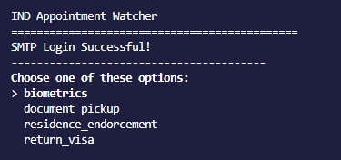

 

  

  <h3 align="center">IND Appointment Watcher</h3>

  

    This program scrapes any IND appointment pages you want it to for new availability every X minutes and sends you an email if it finds anything new.
     
     
    I am currently waiting on a response from the IND on my visa, in the meantime I was told to setup appointments in Amsterdam for a few things way in advanced because theres basically zero availability. Things open up once in awhile so I wanted to write this program to email me if theres any new appointments dates.
     
     
    This scrapes any appointment page you configure, all of the appointment pages on the official IND website are compatible you just have to configure the one you want in the "categories.json" file if its not already setup.
     
    
  

  

  
  

  <h3 align="center">Installation</h3>
    Run the following commands.
  

    pip install -r requirements.txt 
  

  Then copy the `.env.example` file to `.env` and fill in the variables.
  For the SMTP variables, you can leave them default and go get an app password for your Gmail account <a href="https://myaccount.google.com/apppasswords">here</a>. (you must have two factor enabled to get this).
 
 
  If you are on linux, you have to install a version of chrome using the following commands:
  

    sudo curl -sS -o - https://dl-ssl.google.com/linux/linux_signing_key.pub | apt-key add 
    sudo bash -c "echo 'deb [arch=amd64] http://dl.google.com/linux/chrome/deb/ stable main' >> /etc/apt/sources.list.d/google-chrome.list" 
    sudo apt -y update 
    sudo apt -y install google-chrome-stable 
  

  I have not ran this on windows yet, although I believe I have included all of the modules that will allow it to work. Otherwise I plan to test this on Windows as well later on.

  

  <h3 align="center">How to use</h3>
    After doing the `installation` steps, you can then run this program using these commands:
  

    
     python3 main.py
  

